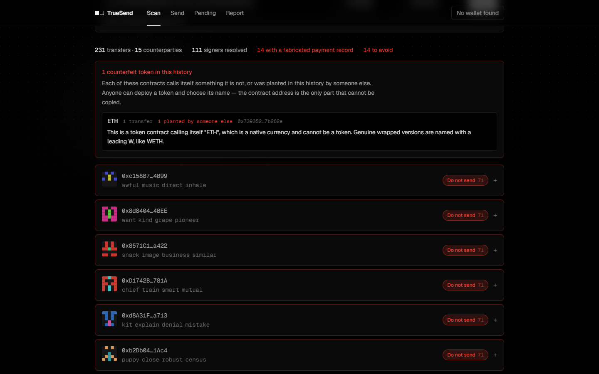
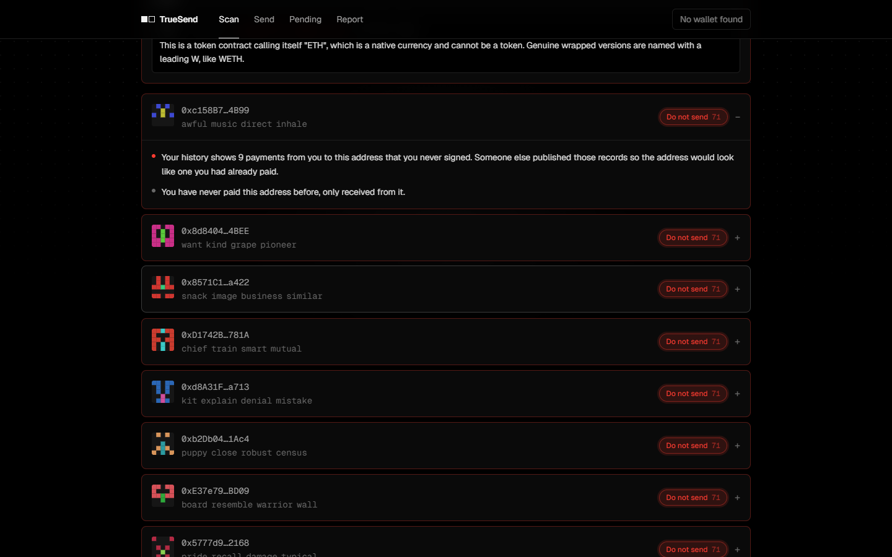
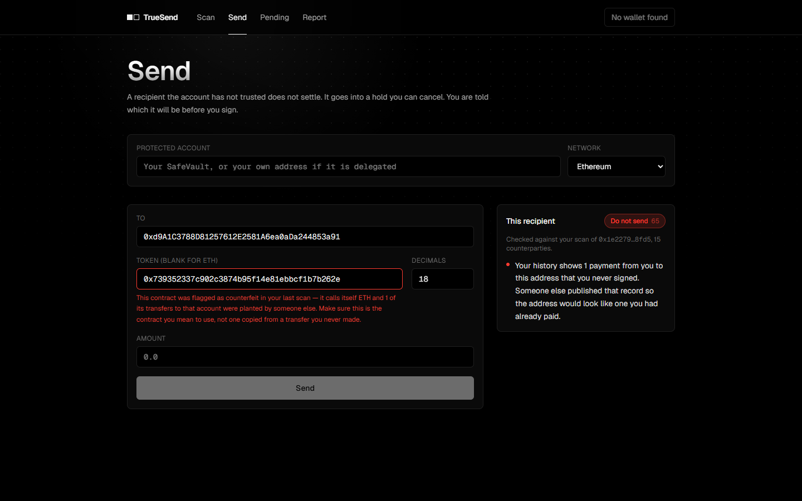
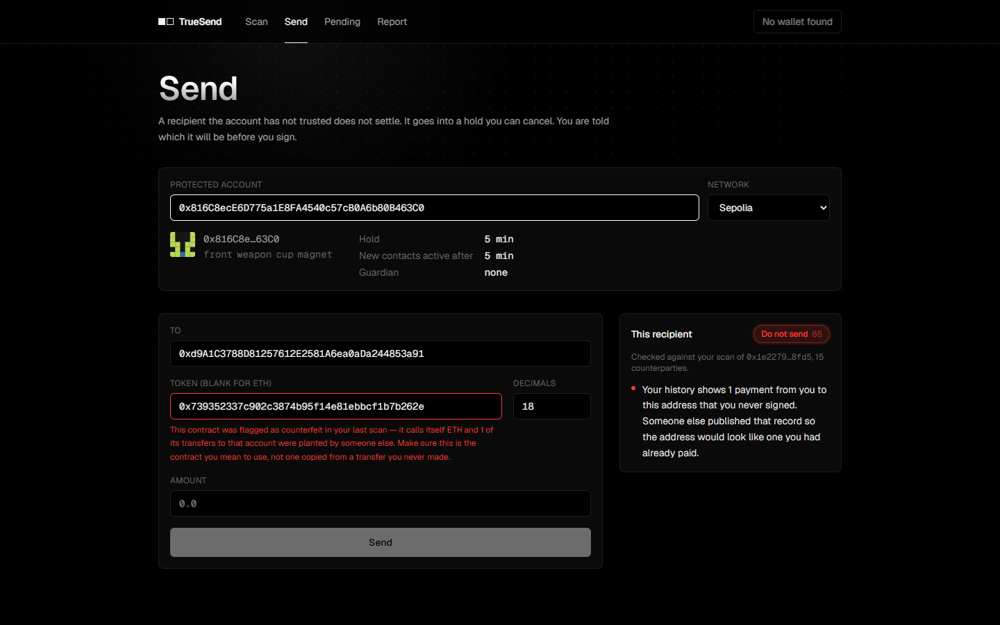
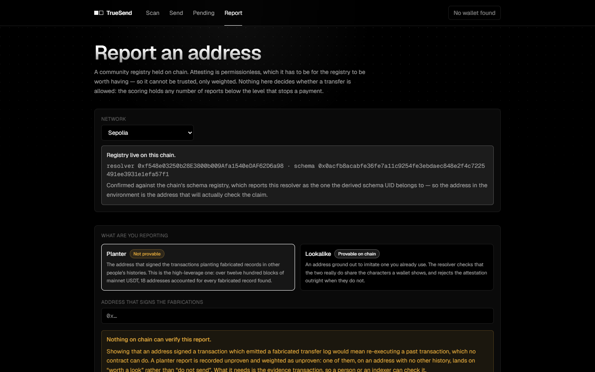

# TrueSend

[](https://github.com/KunnnnnQ/TrueSend/actions/workflows/ci.yml)

[](https://kunnnnnq.github.io/TrueSend/)

**[Live demo](https://kunnnnnq.github.io/TrueSend/)** — the Scan screen reads real mainnet history
from your browser, nothing to install or connect; *Load the 1155 WBTC loss* replays the verified
May 2024 case. Send, Pending and Report talk to the contracts [deployed on Sepolia](#deployed-on-sepolia):
choose Sepolia and they read real on-chain state; sending or reporting needs a wallet with Sepolia ETH.

**[Demo video](#what-it-looks-like)** — 87 seconds, captioned, no sound: the May 2024 case, the
warning that follows you to Send, the EIP-7702 hold live on Sepolia, and the community registry.

**[Browser extension](https://github.com/KunnnnnQ/TrueSend/releases/latest)** — download the zip
from the latest release, unzip it, and in `chrome://extensions` turn on Developer mode and choose
*Load unpacked*. Built and tested by CI from the release's tag; not on the Chrome Web Store.

**Everyone is told to send a small test transfer first. Attackers do not wait for yours — they
fabricate one.**

Anyone can call a contract that emits a `Transfer` log naming *you* as the sender. No approval, no
signature, nothing you can refuse. Your history then shows a payment to an address you have never
paid, and whether your wallet notices depends on a filter it bought from somebody else. Of 53
popular Ethereum wallets evaluated in 2025, 16 displayed fabricated transfers as real, most
outsourced the filtering to their activity provider, and **only three warned when the user went to
pay the address** ([Guan and Li, arXiv:2508.12107](https://arxiv.org/abs/2508.12107)).

Etherscan, where most victims copy the address they later pay, does warn — with a dialog at its own
copy button when the transfer was signed by a different address than the sender, and by labelling
attackers it already knows. Of 30 planted lookalikes sampled a week after they were planted, one
carried a label. That protection stops at the edge of one site's copy button;
[`docs/prior-work.md`](docs/prior-work.md) §6 says exactly how far it reaches and how it was
checked.

That is how 1155 WBTC was lost in May 2024. The victim's "cautious test transfer" 73 minutes
before the real one was signed by somebody else, on a token contract whose symbol is `ETH`. Every
step of that is re-derived from chain and asserted in [`analysis/`](analysis/README.md) — not
taken from the write-ups, which mostly describe it wrongly.

It is not rare. In one four-hour window of mainnet USDT, **99.88% of zero-value transfers were
signed by somebody other than the address they name as sender**, and 5,121 distinct addresses had
a fabricated payment planted in their history.

A test transfer never verified that an address is *correct*. It only ever verified that it is
*reachable*.

TrueSend replaces the test transfer with two things that actually work:

- **A revocable hold on chain.** A transfer to a recipient your account has not trusted is queued,
  not sent. You — or a guardian who can veto but never spend — can drop it during the hold. This
  does not depend on you noticing anything while you sign.
- **A fingerprint a person can check.** Four dictionary words and a small glyph derived from the
  address. Two addresses that look identical in every wallet do not look identical here.

```
|██  ██  ██|        |  ██  ██  |
|██████████|        |  ██████  |
|██████████|        |██  ██  ██|
|  ██  ██  |        |██  ██  ██|
|  ██  ██  |        |  ██  ██  |

 0xAb58c4…0e93       0xaB58c4…0E93
 okay law add lunch  salute hollow mention submit
```

Same first six and last four characters. Same row in your wallet. Different everything else.

## What it looks like

https://github.com/user-attachments/assets/f29f1c79-20e6-4129-ae1d-ae74faa6a8bd

| Every verdict says why | The scan follows you to Send |
| --- | --- |
|  |  |
| **The EIP-7702 account, read from Sepolia** | **The community registry, live on Sepolia** |
|  |  |

The video and the pictures are all the live demo, recorded in a browser against real mainnet
history and the Sepolia deployment. [`docs/demo-script.md`](docs/demo-script.md) has the script
that recorded the video, the addresses it used, and why those ones.

## Two modes

|  | `GuardedAccount` | `SafeVault` |
| --- | --- | --- |
| How | EIP-7702 delegation on your existing EOA | A contract that holds the funds |
| Migration | None — keep the address people already know | Fund a new address |
| Guarantee | Every payment routed through the account interface is held | Unbypassable by construction |
| Limitation | The key can still sign a raw transfer that never reaches the delegate | Counterparties must learn the new address |

That limitation is a property of EIP-7702, not of this implementation — the EIP changes what
happens when someone *calls* your address, not your key's ability to *originate* a transaction. It
is asserted by two named tests rather than buried in prose, and
[`docs/threat-model.md`](docs/threat-model.md) says exactly how far each claim reaches.

## The one property worth reading

Across arbitrary orderings of sends, cancels, trust changes, cooldown changes and waiting:

> every wei that left the vault either went to a recipient whose trust delay had fully elapsed, or
> sat in the queue until its unlock time.

Checked by `invariant_everyPayoutWasTrustedOrWaitedOutItsCooldown` over a fuzz campaign. The
campaign carries its own anti-vacuity test, because two earlier versions of it passed every
property while moving zero funds.

## Design decisions worth defending

**Policy changes are asymmetric.** Tightening applies immediately; loosening is itself queued
behind the current cooldown. Without that, anyone holding the key sets the cooldown to zero and
drains in one transaction, and the whole mechanism is decorative.

**Trust activates on a delay.** Otherwise "add the poisoned address to contacts, then send" is a
one-transaction bypass.

**The guardian's power is strictly negative.** It can veto a transfer and revoke trust. It cannot
move funds, and it cannot veto its own replacement — a guardian that could entrench itself would
hold the account hostage.

**The cooldown never consults the risk score.** Heuristics are public and evadable. An unknown
recipient is held regardless of what the engine thinks. The score changes what the user is *told*,
never what the contract *allows*.

**The registry reports the planter, not the lookalike.** Measured: 5,665 disposable lookalike
addresses in four hours, planted by 18 addresses, one of them responsible for 86%. A registry of
lookalikes needs thousands of entries a day; a registry of planters needs a handful. And because
attesting is permissionless, no number of reports can reach "do not send" on its own — a registry
that could condemn an address by itself would be a griefing tool aimed at the people this protects.
[`docs/registry.md`](docs/registry.md).

**One signal needs nothing remembered.** When someone reads their own transaction list, the
planted address and the one it imitates are both on the screen. The extension outlines them where
they sit, in the list, next to each other — no history, no network, no guess about intent. Asking
a user to compare two 42-character strings from memory is the thing they cannot do, and the
reason the attack works.

That claim was false for a while. The scan read addresses out of page text, and real explorers do not
print addresses — Etherscan draws `0x1E227979...a6F538FD5`, Blockscout draws `0x79...41C0`, and the
whole address is in an attribute. On two real pages, **0 of 236 addresses were readable from text**, and
every test had passed because every test built its transaction list out of full addresses. It now reads
the attributes, is tested against rows copied verbatim from both explorers, and was run in a real
browser against a live account being poisoned at the time: 20 addresses found where there had been none,
all 23 outlines visible. It runs in web pages and nowhere else — not in a wallet's extension popup, not
on a phone.

**A hold nobody hears about is only a delay.** The watcher alerts the owner *and* the guardian
within a poll, with a one-click cancel link that lands on the transfer. An alert is never sent
twice and a failure is never dropped, because a user who stops watching for themselves on the
strength of a promise deserves that promise kept.

**It has been measured against the thing that kills security tools.** Across 59 randomly sampled
active wallets, 52.5% saw no warning at all, and **97% of every warning that did fire rests on a
checkable fact** rather than an inference — a transfer log naming the user as sender in a
transaction they demonstrably did not sign. Those facts are checked rather than asserted: each
record is reconciled against the token's own balances, and all 884 held up. A tool that cries
wolf gets switched off, and then it protects nobody, so that number is the one worth arguing
about. [`analysis/README.md`](analysis/README.md#does-it-cry-wolf).

**It has been run against somebody else's cases, and they found a hole.** Replayed against the 144
poisoning baits Guan and Li published with their CCS 2024 paper — chosen by them, not by this
project — the detector put all 100 zero-value and counterfeit-token baits at "do not send", and
flagged no address the victim had genuinely paid (121 of 121 clean). But 40 of the 44 dust baits
copied only the end of the address they imitated — the last seven characters, fewer than four of
the first — and the lookalike rule, which wanted four at both ends, recognised none of them: they got a
generic caution that never named who was being imitated. The rule now also accepts seven at the end
alone. That seven was read off the same sample, so it was checked on fresh mainnet data instead:
across 27.9 million comparisons between genuine counterparties it matched none (0.1 expected by
chance), and in four hours it recognised 126 dust plantings the old rule missed.
[`analysis/README.md`](analysis/README.md#against-somebody-elses-cases).

**Measuring it found two ways it cried wolf. Fixing the second one found a worse bug hiding behind
the fix.** A transfer you did not sign is not always a fabrication: someone you authorised — a
Permit2 filler, a CoW solver, a relayer spending a gasless signature — can move your tokens for
you, and 4.6% of nonzero USDT and USDC transfers are exactly that. The detector scored those
71/100 danger, the same score it gives the address that took 1155 WBTC. Fixed, and checked against
eight real histories pulled from live mainnet: 71/100 danger before, 0–6/100 safe after.

The second one is a smart account, whose every payment is submitted by a bundler rather than
signed by the account itself — telling one apart from an EIP-7702 delegated EOA, which also has
code but still signs, is read from the exact designator EIP-7702 defines rather than guessed; on
live mainnet 16% of token senders are delegated EOAs, so guessing wrong would not have been a
corner case. The first fix for this credited a smart account's *unsigned* transfers as genuine
payments, on the reasoning that a contract's balance only moves when its own code moves it — which
is false for the same reason the fabrication rule exists at all: a `Transfer` log is not evidence,
so an attacker's own token can claim a smart account received and later sent its tokens for the
price of two log entries and no signature from anyone. That version would have scored the
attacker's own address a clean, fully-trusted payee. Found before it shipped anywhere, by asking
whether the fix was actually safe rather than trusting green tests; pinned as a permanent
regression test. The account classification stays and is correct; a contract account's unsigned
transfers now land in the same bucket as an EOA's authorised third party, never as a payment it
made — which means the lookalike rule still has no payees to compare against for a smart-account
owner. That gap is real, open, and recorded in
[`docs/threat-model.md`](docs/threat-model.md), not patched with something unsafe. The fabrication
rule — the one that matters more, and the only reason the WBTC case is caught at all — works
correctly for these accounts either way.

**The counterfeit tokens are in the history too.** The bait in the May 2024 case was a token calling
itself `ETH`. On a real account being poisoned on 2026-09-26, sixteen of seventeen token contracts in its
recent history were counterfeits — eleven posing as USDT in four spellings, five posing as ETH — and
every one of their transfers had been planted. The Scan screen now reads what each token calls itself and
says so; before that, the token rules existed, were tested and were listed as a defence, and nothing in
the product called them. Measured against Uniswap's curated token list they flag none of 408 legitimate
tokens, after a first version flagged MATIC, SOL and POL; that list is now also a second, weaker tier
of names, questioning a namesake at another contract and convicting it only once it has been planted.
Names were not enough, though: on accounts
being poisoned this hour, a "cbBTC" that is not Coinbase's, and contracts with no name at all, passed
every name rule. A token is now also counterfeit on its own records — the account "sending" an amount
it never held, in a transaction somebody else signed — and in three runs of 25 such accounts, no token
the accounts had moved themselves was flagged.
[`analysis/README.md`](analysis/README.md#on-accounts-being-poisoned-right-now).

**Scores explain themselves.** Every finding carries a sentence naming the contact being imitated
and both fingerprints. A bare number asks for trust; a reason lets the user catch what the rules
missed.

**One rule is a fact, not a heuristic.** A transfer log naming you as the sender, in a transaction
you did not sign, is a record of a payment that did not happen. It is the highest-weighted rule,
it needs no lookalike to compare against, and it is the only reason the WBTC case is caught at
all — the victim's history contained nothing resembling the attacker's address, so every
similarity rule scored it zero. Measured: `safe` (0) before, `danger` (71) after. One exception,
found on accounts being poisoned right now: planters also copy real payments — same amount, same
real recipient, minutes later — and the rule used to tell users "do not send" to their own contacts.
When the user's own signed payment came *before* the fake, the copy is now shown and not held against
it. The other order — the fake first, then a payment — is the attack working: a first version of this
fix ignored the order and called the May 2024 attacker "Looks fine" on the live demo, until loading
the preset caught it. In a final run of 25 accounts the copy was on 16 of 136 contacts the accounts
had paid, and none of the 136 was warned about.

**A record the scan could not check is never quietly dropped.** Knowing who signed a transfer takes
one request per transaction, and public endpoints refuse requests when they are busy. Until
2026-10-07 a refused lookup dropped that transfer without a trace: on the May 2024 case, refusing
only the bait's lookup turned the attacker from "Do not send 65" into "Looks fine 0", while the
screen reported "110 signers resolved" as though nothing were missing. The Poison-Hunter replay had
already been guarding against exactly this — for the measurement, not for users. Refused lookups
are now asked again, one at a time, and whatever still does not come back makes the scan say it is
incomplete, on Scan and on Send, and makes every address it touches at least "worth a look". A
token name the endpoint will not read is said to be unread by the endpoint, not a token that "would
not say". Fewer lookups also means fewer to refuse. Where the endpoint puts each block's time on the
log, as the default one does, blocks are no longer asked about at all. And only a transfer naming
the account as its sender needs its signer, so a transaction the account only received in is not
asked about — across the 143 victims' histories in the Poison-Hunter replay, a third of all
transactions. The preset now takes 110 lookups instead of 188, and it is replayed on every push from
a recording of what mainnet said about it, with the bait's lookup refused as well as answered, so a
regression like the last one fails CI instead of waiting to be found by hand.

## Status

| Component | State |
| --- | --- |
| `contracts/` — policy, 7702 delegate, vault, factory, community registry | Built and [deployed on Sepolia](#deployed-on-sepolia). 94 tests: unit, fuzz, invariant. 100% branch coverage |
| `packages/engine/` — fingerprints, heuristics, scoring | Built. 193 tests including property tests |
| `packages/chain/` — history with signer resolution, token identities, policy reads | Built. 50 tests, among them the live demo's May 2024 preset replayed from recorded mainnet answers. Shared by the app and the indexer |
| `apps/web/` — Scan, Send, Pending | Built. Scan reads mainnet directly, resolves signers and reads what every token in the history calls itself; that scan follows the user to Send, which also recognises a token address Scan already flagged; Send and Pending drive a deployed policy. 5 browser tests run the static export Pages publishes on the recorded May 2024 case, at laptop and phone widths |
| `apps/indexer/` — hold watcher, alerts, risk API | Built. 17 tests on alert idempotency and resume |
| `apps/extension/` — copy and paste guard, in-page collision scan | Built and [released](https://github.com/KunnnnnQ/TrueSend/releases/latest). 41 tests, 13 of them against markup copied from real Etherscan and Blockscout pages |
| `analysis/` — replay against real mainnet cases | Built. Verifies the 2024 WBTC case from chain, measures live poisoning volume and the false-positive rate, replays the shipped detector — including over 144 poisoning cases somebody else published, and the whole Scan screen on accounts being poisoned right now |

Not audited.

### Deployed on Sepolia

Deployed on 2026-10-06 by `Deploy.s.sol` and `RegisterSchema.s.sol`. The records the live demo is
built from are committed under [`contracts/deployments/`](contracts/deployments/), so no address in
the app was copied by hand. The source of all four is verified — an exact match on Etherscan and a
match on Sourcify, since 2026-10-07 — so each link below opens the code itself.

| Contract | Address |
| --- | --- |
| `GuardedAccount`, the EIP-7702 delegate | [`0xA49E0f1A8d19DF34C70B6771bBa28b566BA7efA5`](https://sepolia.etherscan.io/address/0xA49E0f1A8d19DF34C70B6771bBa28b566BA7efA5) |
| `SafeVault`, the clone template | [`0x14772F1683Dd06e49Def09E5fCd196e62Aa28E83`](https://sepolia.etherscan.io/address/0x14772F1683Dd06e49Def09E5fCd196e62Aa28E83) |
| `SafeVaultFactory` | [`0x02B3A163045c280364B03714DeCdd3627DDCa949`](https://sepolia.etherscan.io/address/0x02B3A163045c280364B03714DeCdd3627DDCa949) |
| `PoisonRegistry`, the EAS resolver | [`0xf548e03250b28E3800b009Afa1540eDAF62D6a98`](https://sepolia.etherscan.io/address/0xf548e03250b28E3800b009Afa1540eDAF62D6a98) |

`Smoke.s.sol` then ran against those addresses and passed all eight checks. On chain, a fresh vault
([`0x9Bb7…f940`](https://sepolia.etherscan.io/address/0x9Bb7982b04Ce2116296780380401b002A6F7f940))
queued a payment to a never-seen recipient instead of sending it, and the payment was then
cancelled; a true lookalike claim was attested through the real EAS and marked verified by the
registry ([transaction](https://sepolia.etherscan.io/tx/0xc12d6af9e87b1d966555b243b3ef6cb5308ea46bceacb1d7c437c4bba09546f1)).
The two refusals — executing before the hold ends, and a lookalike claim between unrelated
addresses — were checked against the same deployed bytecode without being broadcast, so nothing
that was meant to fail was sent. To see a real policy in the live demo, choose Sepolia on Send or
Pending and enter that vault's address.

The EIP-7702 path was then checked by hand on 2026-10-07, with a live signature from the deployer's
own key ([`docs/deploy-sepolia.md`](docs/deploy-sepolia.md), step 5). One type-4 transaction
delegated the account to `GuardedAccount` and switched its policy on
([transaction](https://sepolia.etherscan.io/tx/0xe92c3fd33ef9ed4fbe7cb2239fbfb177b1243fe6cceab0bb1ef24acf9b350b00));
a payment to a never-paid address was queued instead of sent
([transaction](https://sepolia.etherscan.io/tx/0xb485be4e629e91959a9f24ea62ead21efeccbe4e35e2c6b40274a910904f87a3));
executing it early reverted with `TransferLocked`; and it was cancelled
([transaction](https://sepolia.etherscan.io/tx/0xc7d9556438b36c4f8ea80192cb8037470a0283044d1c6f50ae9f6ee86bbd96ac)).
Read back afterwards: the account carries the `0xef0100` designator for `GuardedAccount`, and
transfer 1 is cancelled. The live demo shows that account's policy on Sepolia:
`0x816C8ecE6D775a1E8FA4540c57cB0A6b80B463C0`.

Branch coverage was 64.6% and called out here as the weakest number in the repo. A coverage report
then named the eighteen untaken branches and **every one of them was an error path** — a policy
that had never been shown to refuse an uninitialised account, a queue that had never been shown to
refuse a second cancellation, a cooldown that had never been shown to refuse zero. In a contract
whose whole job is refusing things, those are the branches that matter most. They are covered now,
in `contracts/test/PolicyGuards.t.sol`, and branch coverage is 100%.

## Running it

Contracts need [Foundry](https://getfoundry.sh) (CI pins 1.8.3); everything else needs Node 22.13 or
later and pnpm via corepack. The floor is the indexer's: it stores state in Node's built-in
`node:sqlite`, which older versions do not have. CI runs on Node 24. `pnpm install` also builds the
two shared libraries, `@truesend/engine` and `@truesend/chain`, that every other package imports.

```bash
cd contracts && forge test
```

```bash
corepack pnpm install && corepack pnpm -r test
```

The app runs against real mainnet history with nothing deployed — Scan needs only an RPC. There
is a preset that loads the verified 2024 WBTC case, so the screen has something real to show
against a wallet that has never been targeted.

```bash
corepack pnpm --filter @truesend/web dev
```

Send and Pending need a policy to act on. On Sepolia that is the deployment above — to point a
local dev server at it, `node tools/deployment-env.mjs >> apps/web/.env.local`; for a local chain,
`contracts/deployments/README.md` has the two commands.

The whole Sepolia deployment can be rehearsed first, free, against a local fork of Sepolia — nothing
is sent anywhere and nothing in the repository is written ([`docs/deploy-sepolia.md`](docs/deploy-sepolia.md)
has the full sequence):

```bash
node tools/rehearse-sepolia.mjs
```

Deploying uses a keystore rather than a raw key, and writes an address book the app reads
directly so no address is ever transcribed by hand:

```bash
cast wallet import truesend-deployer --interactive
```

```bash
cd contracts && forge script script/Deploy.s.sol --account truesend-deployer --rpc-url sepolia --broadcast
```

## Layout

```
contracts/          Foundry. PolicyLib + GuardedBase, then GuardedAccount (7702) and SafeVault
packages/engine/    Pure TypeScript. Runs identically in the app, the extension and the API
apps/web/           Next.js. Scan reads history and checks signers; Send quotes before you sign;
                    Pending counts down against chain time and cancels
apps/extension/     Copy and paste guard. Outlines addresses on a page that render identically
apps/indexer/       Watches for holds, tells the owner and the guardian, serves risk queries
packages/chain/     Reading history and policy state. One implementation of "check the signer"
analysis/           Replaying the detectors against real cases
docs/               architecture.md, threat-model.md, registry.md
```

## License

MIT.
